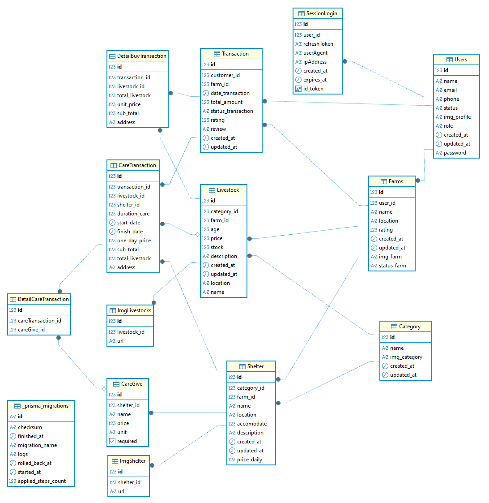

# SmaFarm API Documentation

## Overview
This API is part of the **SmaFarm Project**, a platform for **livestock shelter rental (care services)** and **livestock trading**.  
It provides endpoints for managing users, shelters, livestock, transactions, and other related operations to power the SmaFarm website.

---

## Base URL


## 📌 Project Smafarm

---

## ✨ Endpoint and Features Implemented
### 1. Endpoint

---

## Endpoints

| Method | Endpoint | Description |
|---------|----------|-------------|
| **User Management** |||
| `POST` | `/auth/register` | Register a new user account. |
| `POST` | `/auth/login` | Login to get an authentication token. |
| `GET` | `/users` | Get all users (admin only). |
| `GET` | `/users/:id` | Get details of a specific user. |
| `GET` | `/users/profile` | Get profile user. |
| **Shelter Management** |||
| `GET` | `/shelters` | Fetch a list of available shelters. |
| `GET` | `/shelters/:id` | Get details of a specific shelter. |
| `POST` | `/shelters` | Create a new shelter (admin only). |
| `PATCH` | `/shelters/:id` | Update details of a shelter (admin only). |
| `DELETE` | `/shelters/:id` | Delete a shelter (admin only). |
| **Livestock Management** |||
| `GET` | `/livestock` | Fetch all livestock data. |
| `GET` | `/livestock/:id` | Get details of a specific livestock. |
| `POST` | `/livestock` | Add a new livestock item (admin only). |
| `PATCH` | `/livestock/:id` | Update livestock data (admin only). |
| `DELETE` | `/livestock/:id` | Delete livestock (admin only). |
| **Transactions** |||
| `POST` | `/transactions/transactioncare` | Create a new care transaction. |
| `GET` | `/transactions/transactioncare` | Fetch all care transactions (filterable by `shelter_id`). |
| `GET` | `/transactions/transactioncare/:id` | Get details of a specific care transaction. |
| `PATCH` | `/transactions/transactioncare/:id` | Update a care transaction (e.g., finish date, status). |
| `DELETE` | `/transactions/transactioncare/:id` | Cancel or remove a care transaction. |
| `POST` | `/transactions/transactionbuy` | Create a new purchase transaction. |
| `GET` | `/transactions/transactionbuy` | Fetch all purchase transactions. |
| `GET` | `/transactions/transactionbuy/:id` | Get details of a specific purchase transaction. |

---
## ERD Database
 


## Install Project
### Clone my project and install
```bash
git clone https://github.com/revou-fsse-feb25/final-project-be-Salthof28.git

cd final-project-be-Salthof28

npm install 
or 
pnpm install

```
### setting .env
Create a .env file. Check the .env.example file for the proper format and variables.
### run project
```bash
npx prisma migrate dev
or
pnpx prisma migrate dev

npm run start:dev
or
pnpm run start:dev

```

## Link Demo

**Live Demo:** [smafarm-be](https://3a9faba3-4e26-4988-b04a-1d21b7e8014e-00-nz4pnvue4orv.pike.replit.dev:3000)

## If You Want Test Login
### Admin
```bash
email: jane@mail.com
password: jane123
```
### Breeder
```bash
email: taiga@mail.com
password: taiga123
```
### Customer
```bash
email: john@mail.com
password: john123
```
## Author
🔧 Salman Althof
